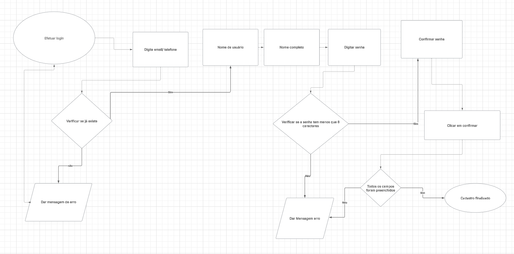
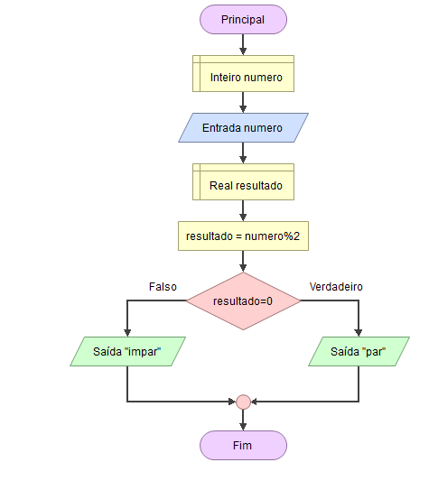

# Fluxogramas-pesquisa
   

## Introdução:
Neste trabalho, exploraremos o que é um fluxograma, seus principais símbolos e como ele é utilizado no desenvolvimento de sistemas, além de apresentar ferramentas eficientes para a criação desses diagramas.

## O que é um fluxograma?
O fluxograma é uma ferramenta que ilustra as etapas, sequências e decisões de um processo ou fluxo de trabalho, sendo a forma mais simples de um mapa de processo. Ele é usado para planejar, visualizar, documentar e otimizar processos em diversas áreas. 
Foi apresentado pelos engenheiros Frank e Lillian Gilbreth à American Society of Mechanical Engineers (ASME) em 1921 e, desde então, passou por aprimoramentos para ser utilizado em diversos setores.tendo hoje mais de 30 símbolos para criar e padronizar na criação desse diagrama.

## Principais símbolos:

### Oval (Símbolo de Terminal):

Sempre rotule esse símbolo de fluxograma claramente como "Início" ou "Fim" para definir os limites de todo o processo, garantindo que os visualizadores possam identificar facilmente onde o fluxo de trabalho começa e termina.

### Retângulo (símbolo de processo)
 

Esse símbolo de processo descreve tarefas, ações ou operações específicas dentro do processo, fornecendo rótulos detalhados que esclarecem o que acontece em cada estágio. É o símbolo mais comumente usado e forma o núcleo da maioria dos fluxogramas.

###  Diamante (símbolo de decisão)
 

 As ramificações devem emergir do diamante com base nos possíveis resultados (por exemplo, Sim/Não ou Verdadeiro/Falso). Rotule claramente cada ramo para orientar o fluxo da tomada de decisão.

### Paralelogramo (símbolo de entrada/saída)
 
 
 É essencial para visualizar o fluxo de dados em processos que envolvem interação com o usuário ou saída do sistema.

 ### Seta (linha de fluxo)
 
 
 Elas conectam símbolos e mostram a direção. 

### Símbolo do documento

Use esse símbolo para ilustrar onde os documentos são criados, revisados ou utilizados no processo, ajudando a rastrear o fluxo de papelada ou registros digitais.

### Símbolo do banco de dados

Mapeie os processos que envolvem recuperação ou armazenamento de dados com este símbolo que ajuda a identificar onde os dados são armazenados e acessados.

### Símbolo de entrada manual

Use esse símbolo para destacar interações do usuário que exigem entrada de dados, o que pode ser crucial para entender as dependências do processo em ações manuais.

###  Símbolo de preparação

Use esse símbolo para ilustrar ações preparatórias que preparam o cenário para as etapas subsequentes, garantindo que os pré-requisitos sejam claramente identificados.

### Símbolo de atraso

Use este símbolo para indicar períodos de espera e atrasos no processo. Ele ajuda a identificar áreas potenciais onde há perda de tempo e onde podem ser feitas melhorias. Adicione também um rótulo especificando a duração.

### Símbolo do conector

Adicione este símbolo para linkar diferentes partes do fluxograma que, de outra forma, seriam difíceis de acompanhar, especialmente em diagramas grandes ou complexos.

### Símbolo de conector fora da página

Garanta a continuidade em fluxogramas de várias páginas usando esse símbolo para conectar perfeitamente os processos entre as páginas, mantendo um fluxo lógico.

### Símbolo de mesclagem

Com esse símbolo, você pode converter vários caminhos paralelos em um só, simplificando fluxos de trabalho complexos e esclarecendo como diferentes ramificações são reconciliadas.

### Símbolo de dados armazenados

Indica onde os dados são armazenados de forma persistente (geralmente em um banco de dados ou em outra mídia de armazenamento), destacando os pontos de retenção de dados no processo. Isso difere do símbolo de armazenamento interno que é usado principalmente em fluxogramas de projeto de software.

### Símbolo da tela

Use esse símbolo para mostrar onde as saídas são visualizadas, como em uma tela ou monitor, o que é importante para processos que envolvem a interação do usuário com os dados exibidos.

### Símbolo de chamada

Fornece informações, comentários ou explicações adicionais que são relevantes para uma determinada etapa ou decisão em um fluxograma e esclarece etapas ou decisões complexas. Esse símbolo ajuda a oferecer detalhes adicionais que podem não se encaixar perfeitamente nos símbolos primários.

###  Símbolo de soma de junções

Ilustre os pontos do processo em que várias entradas são combinadas com este símbolo. Ele fornece um visual claro das operações cumulativas.

###  Símbolo de processo predefinido

Use os símbolos de processo predefinidos para fazer referência a processos que estão detalhados em outros fluxogramas ou seções, ajudando a simplificar diagramas complexos ao evitar redundância.

### Símbolo de vários documentos

Ilustre cenários em que vários documentos são gerados ou referenciados usando esse símbolo, auxiliando na compreensão de fluxos de trabalho com muitos documentos.

### Símbolo de operação manual

Use esse símbolo para denotar tarefas manuais dentro do processo, o que é crucial para entender onde a intervenção humana é necessária.

### Ou símbolo

Use esse símbolo para mostrar pontos no processo em que resultados múltiplos são possíveis, ajudando a ilustrar cenários complexos de tomada de decisão.

## Como os fluxogramas são utilizados no desenvolvimento de sistemas?
Fluxogramas ajudam a visualizar e organizar a lógica de programas ou algoritmos antes de codificar. Eles mostram a estrutura do código e a navegação de usuários. Outros diagramas relacionados incluem UML, Diagramas Nassi-Schneiderman e Gráficos DRAKON, usados para modelagem e programação visual.

### Ferramentas para criação de um fluxograma
#### . Lucidchart – Fácil de usar, versão gratuita limitada e integrações.
#### . Draw.io (diagrams.net) – Gratuita, sem necessidade de cadastro e muito prática.
#### . Microsoft Visio – Tradicional, oferece muitos templates e funcionalidades avançadas (pago).
#### . Canva – Ideal para designs gráficos, com templates de fluxogramas (versão gratuita e paga).
#### . Coggle – Simples e colaborativa, com versão gratuita limitada.
#### . Google Drawings – Ferramenta simples e gratuita para diagramas básicos.

## Prática

## Conclusão
O fluxograma é uma ferramenta essencial para visualizar e otimizar processos, sendo amplamente utilizado em diversas áreas. Sua simplicidade e a utilização de símbolos padronizados facilitam o entendimento e a melhoria de fluxos de trabalho. As ferramentas disponíveis tornam sua criação mais acessível, reafirmando sua importância na organização e eficiência de processos.

